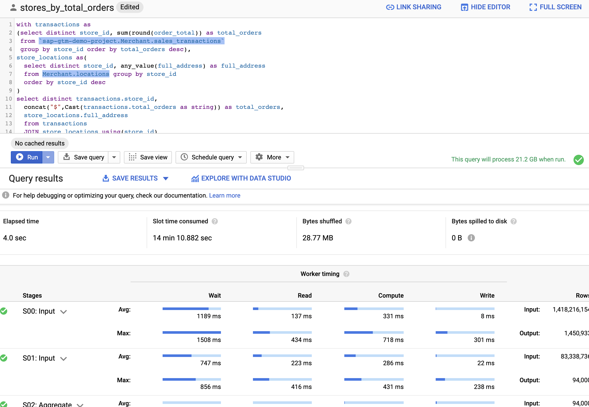
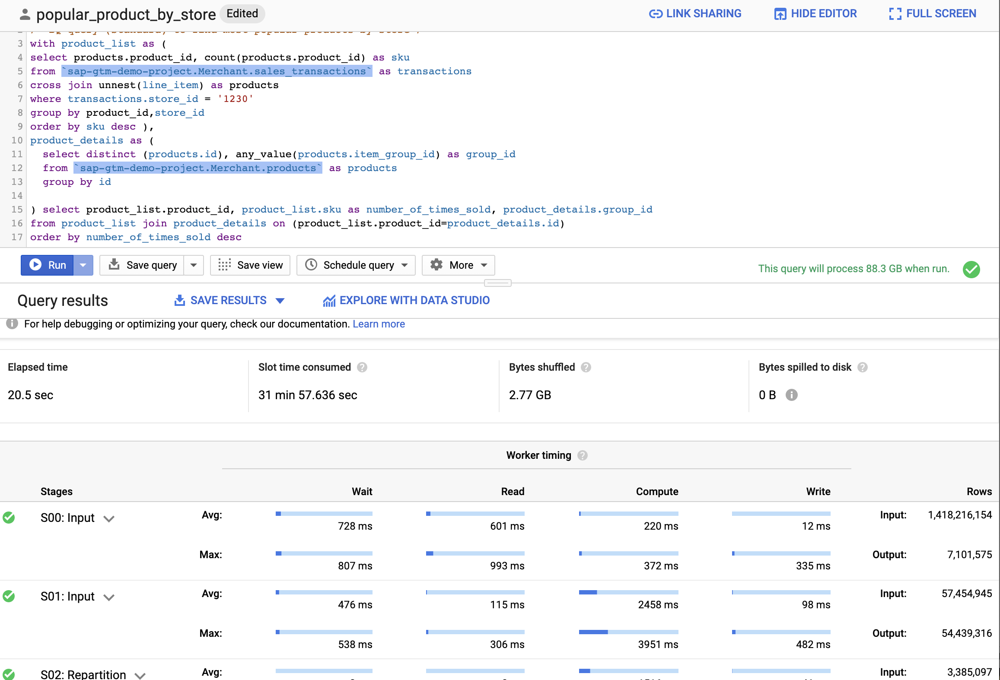

# bq-sql-hana-shootout
Some Queries to Test Out Performance Benefit between SAP HANA vs BQ

### Q1: Total Sales By Store Id

### Q2: Most Popular Products by Store Id

### Summary 

Q1:  Total Sales / Store id. 

Hana: 40-50 seconds  BQ: 8-12 secs. 

- It seems BQ performs better when there is a large number of rows being scanned.

Q2: Most Popular Products by Store Id. 

Hana:  <5 secs BQ: 20 secs. 

- It seems Hana performs better when index is leveraged (Less number of rows scanned). Note that second query uses store id. 